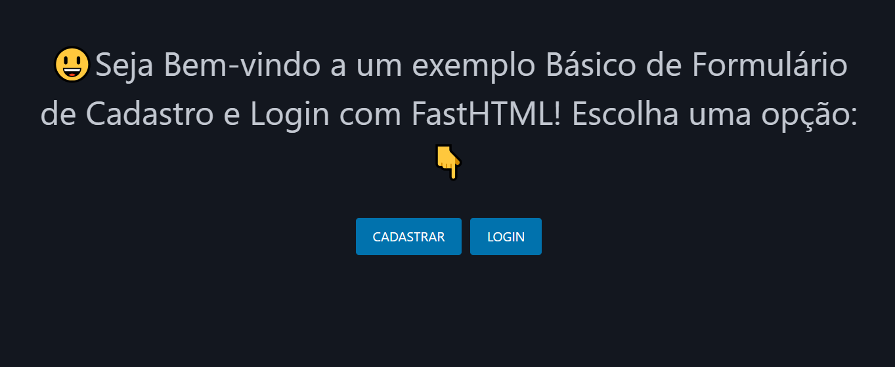
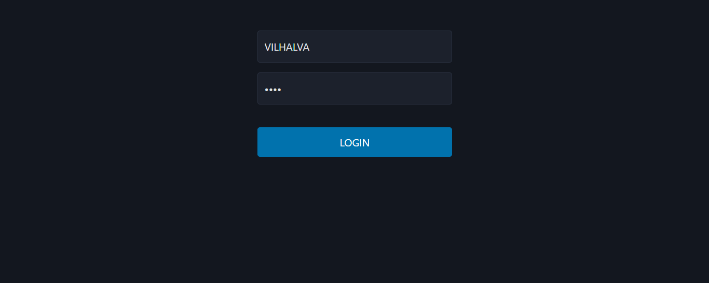
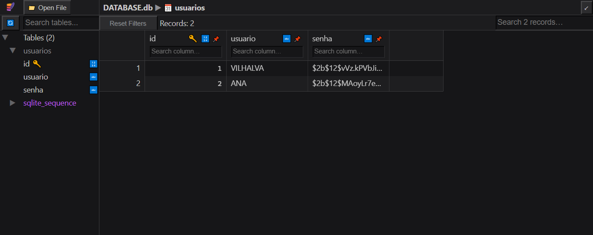

# LOGIN COM FASTHTML
👨‍🏫FORMULARIO DE CADASTRO E LOGIN COM FASTHTML E SQLITE.

 <br>
 <br>
 <br>
 <br>

## DESCRIÇÃO:
Este projeto é um exemplo básico de um sistema de cadastro e login usando o framework **FastHTML** para renderizar páginas e interagir com o banco de dados SQLite. 

## FUNCIONALIDADES:
1. **Banco de Dados SQLite**:
   - O sistema usa o SQLite para armazenar informações de usuários.
   - Se o banco de dados não existir, ele será criado com uma tabela `usuarios`, contendo os campos `id`, `usuario` e `senha`.

2. **Criptografia de Senha**:
   - As senhas dos usuários são criptografadas usando a biblioteca `bcrypt` antes de serem armazenadas no banco de dados.

3. **Rota Principal (`/`)**:
   - Exibe uma página inicial com duas opções de botões: **CADASTRAR** e **LOGIN**.

4. **Rota de Cadastro (`/register`)**:
   - Exibe um formulário de cadastro onde o usuário pode inserir um nome de usuário e senha.
   - Antes de inserir um novo usuário no banco de dados, verifica se o nome de usuário já está cadastrado.
   - Caso não esteja, o sistema criptografa a senha e a armazena.

5. **Rota de Login (`/login`)**:
   - Exibe um formulário de login onde o usuário insere seu nome de usuário e senha.
   - O sistema verifica se o nome de usuário existe no banco de dados e se a senha fornecida corresponde à senha armazenada (comparando com a senha criptografada).

6. **Rota de Tarefas (`/tasks`)**:
   - Após o login bem-sucedido, o usuário é redirecionado para a página de `inicial`, com uma mensagem de boas-vindas.

7. **Mensagens de Erro e Sucesso**:
   - Mensagens de erro e sucesso são exibidas de forma dinâmica (exemplo: "Usuário não encontrado", "Cadastro realizado com sucesso").

8. **Formulários HTML**:
   - O código usa o `FastHTML` para criar formulários dinâmicos de cadastro e login.

## EXECUTANDO ESSE PROJETO:
1. **Instalação das Dependências::**
   - Entre no diretório `CODIGO` e execute o comando:

   ```bash
   pip install -r requirements.txt
   ```

2. **Execução do Aplicativo:**
   - Para executar o arquivo Python, utilize o comando abaixo no terminal, dentro do diretório `./CODIGO`:
   ```bash
   python main.py
   ```

3. **Acesse a página inicial:** 
   - Acesse [http://localhost:5001](http://localhost:5001) no navegador. E escolha entre **CADASTRAR** ou **LOGIN**.

4. Se **optar por se cadastrar**:
   - Preencha o formulário de cadastro na rota `/register`.
   - Se o **cadastro for bem-sucedido**, você será redirecionado a página de login na rota `/login`.

5. Após **fazer login**:
   - Se as **credenciais forem corretas**, você será redirecionado para a rota `/tasks` com a mensagem de `BOAS VINDAS!`.

## NÃO SABE?
- Entendemos que para manipular arquivos em muitas linguagens, é necessário possuir conhecimento nessas áreas. Para auxiliar nesse aprendizado, oferecemos cursos gratuitos disponíveis:
* [CURSO DE PYTHON](https://github.com/VILHALVA/CURSO-DE-PYTHON)
* [CURSO DE FASTHTML](https://github.com/VILHALVA/CURSO-DE-FASTHTML)
* [CURSO DE SQLITE](https://github.com/VILHALVA/CURSO-DE-SQLITE)
* [CURSO DE PYTHON COM SQLITE](https://github.com/VILHALVA/CURSO-DE-PYTHON-COM-SQLITE)
* [CONFIRA MAIS CURSOS](https://github.com/VILHALVA?tab=repositories&q=+topic:CURSO)

## CREDITOS:
- [PROJETO CRIADO PELO VILHALVA](https://github.com/VILHALVA)


